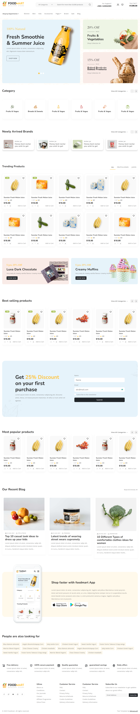

<!-- README-AI-SIGNATURE:f700ed802911c4c2 -->
```markdown
# z-mart

A simple online food mart application.



## Badges


## Key Features
- User-friendly interface for browsing food products
- Responsive design for mobile and desktop
- Attractive product thumbnails and promotional images

## Project Structure
```
z-mart/
├── FoodMart.png
├── images/
│   ├── ad-image-1.png
│   ├── ad-image-2.png
│   ├── ad-image-3.png
│   ├── ad-image-4.png
│   ├── app-store.jpg
│   ├── background-pattern.jpg
│   ├── bg-leaves-img-pattern.png
│   ├── download (1).svg
│   ├── download (10).svg
│   ├── download (11).svg
│   ├── download (12).svg
│   ├── download (13).svg
│   ├── download (14).svg
│   ├── download (2).svg
│   ├── download (3).svg
│   ├── download (4).svg
│   ├── download (5).svg
│   ├── download (6).svg
│   ├── download (7).svg
│   ├── download (8).svg
│   ├── download (9).svg
│   ├── download.png
│   ├── download.svg
│   ├── google-play.jpg
│   ├── icon-animal-products-drumsticks.png
│   ├── icon-bread-baguette.png
│   ├── icon-bread-herb-flour.png
│   ├── icon-soft-drinks-bottle.png
│   ├── icon-vegetables-broccoli.png
│   ├── icon-wine-glass-bottle.png
│   ├── logo.png
│   ├── phone.png
│   ├── post-thumb-1.jpg
│   ├── post-thumb-2.jpg
│   ├── post-thumb-3.jpg
│   ├── product-thumb-1.png
│   ├── product-thumb-11.jpg
│   ├── product-thumb-12.jpg
│   ├── product-thumb-13.jpg
│   ├── product-thumb-14.jpg
│   ├── product-thumb-2.png
│   ├── thumb-bananas.png
│   ├── thumb-biscuits.png
│   ├── thumb-cucumber.png
│   ├── thumb-milk.png
│   ├── thumb-orange-juice.png
│   ├── thumb-raspberries.png
│   ├── thumb-tomatoes.png
│   └── thumb-tomatoketchup.png
├── index.html
├── results.html
├── script.js
└── style.css
```

## Getting Started
To get started with the z-mart application, simply clone the repository and open `index.html` in your web browser.

```bash
git clone https://github.com/MoaazMustafa/z-mart.git
cd z-mart
open index.html
```

## Scripts
- `script.js`: Contains JavaScript functionality for the application.
- `style.css`: Contains styles for the application layout and design.

## Contributing
Contributions are welcome! Please fork the repository and submit a pull request for any improvements or bug fixes.

## License
This project is licensed under the MIT License. See the [LICENSE](LICENSE) file for details.
```
